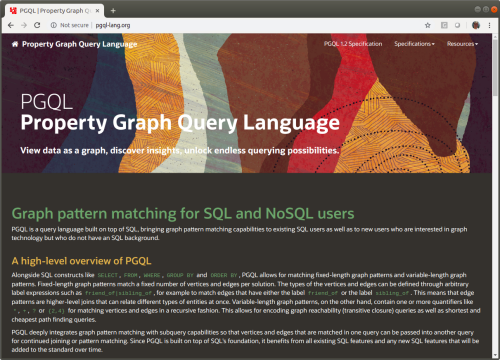

# PGQL - Property Graph Query Language

PGQL is an SQL-based query language for the [property graph data model](https://pgql-lang.org/spec/latest/#property-graph-data-model), bringing graph pattern matching capabilities to SQL and NoSQL users.

See the website for a language specification and any newsworthy updates:

[](https://pgql-lang.org/)

## PGQL Parser and Static Query Validator

This Git repository contains a parser for PGQL with the following features:

 - Easy-to-understand IR: Given a query string, the parser returns an easy-to-understand intermediate representation (IR) of the query as a set of Java objects
    - see [__GraphQuery.java__](graph-query-ir/src/main/java/oracle/pgql/lang/ir/GraphQuery.java)
 - Query validation: built-in to the parser is a static query validator that provides meaningful caret-style (e.g. `^^^`) error messages:

   _Example 1_

   ```sql
   SELECT n.name, o.name
     FROM MATCH (n) -[e]-> (m)
   ```

   ```
   Error(s) in line 1:

       SELECT n.name, o.name
                      ^
       Unresolved variable
   ```

   _Example 2_

   ```sql
   SELECT AVG(n.age), n
     FROM MATCH (n:Person)
   ```

   ```
   Error(s) in line 1:

       SELECT AVG(n.age), n
                          ^
       Aggregation expected here since SELECT has other aggregation
   ```

 - __Pretty printing__: invoking `GraphQuery.toString()` will "pretty print" the graph query, which turns unformatted queries into formatted ones:

   ```sql
   SELECT n.name FROM MATCH
   (n:Person) WHERE n.name = 'Anthony'
   OR n.name = 'James'
   ```

   ```sql
   SELECT n.name
     FROM MATCH (n:person)
    WHERE n.name = 'Anthony'
       OR n.name = 'James'
   ```

 - __Code completion__: given a (partial) query string and a cursor position, the parser can suggest a set of code completions, including built-in functions, labels and properties. These completions can for example be used by an interactive web editor.
   By providing the parser with metadata about the graph (existing properties and labels), the completions will also include label and property suggestions.

## Build and Install the Parser

PGQL's parser can be built on Linux, macOS or Window.

First install JDK 1.8 or higher and Maven 3.5.4 or higher.
Then, follow these instructions:

On Linux or macOS:

 - Build and install to your local Maven repository by running `sh install.sh`

On Windows:

 - Open System Properties and add a new variable `JAVA_OPTS` with value `-Xms512m -Xmx1024m -Xss16m`
 - Build and install to your local Maven repository by running `install_on_windows.bat`

## Getting Started

After you have installed the parser like explained above, parse two [example](example/src/main/java/oracle/pgql/lang/example/Main.java) queries:
 - On Linux or macOS execute `cd example; sh run.sh`
 - On Windows execute:
   ```
   cd example
   mvn clean package exec:java -Dexec.mainClass="oracle.pgql.lang.example.Main" -Dexec.cleanupDaemonThreads=false
   ```

```java
public class Main {

  public static void main(String[] args) throws PgqlException {

    try (Pgql pgql = new Pgql()) {

      // parse query and print graph query
      PgqlResult result1 = pgql.parse("SELECT n FROM MATCH (n:Person) -[e:likes]-> (m:Person) WHERE n.name = 'Dave'");
      System.out.println(result1.getPgqlStatement());

      // parse query with errors and print error messages
      PgqlResult result2 = pgql.parse("SELECT x, y, FROM MATCH (n) -[e]-> (m)");
      System.out.println(result2.getErrorMessages());

    }
  }
}
```

The AST returned by the parser is a [GraphQuery](graph-query-ir/src/main/java/oracle/pgql/lang/ir/GraphQuery.java) object. This would be the input to your query planner.

## Documentation

See the [PGQL Specification](https://pgql-lang.org/spec/latest/).

## Development

- Download Eclipse with Spoofax 2.5.16 pre-installed [here](https://www.metaborg.org/en/latest/source/release/note/2.5.16.html)
- Import the following projects into Eclipse (`File>Import...>Maven>Existing Maven Projects>Browse...`):
    - `graph-query-ir`: Java representation of graph queries
    - `pqgl-spoofax`: Spoofax implementation of PGQL (parser + error checks)
    - `pgql-lang`: translation of Spoofax AST into `graph-query-ir`

## Contributions

PGQL is an open source project. See [Contributing](CONTRIBUTING.md) for details.

Oracle gratefully acknowledges the contributions to PGQL made by the community.
