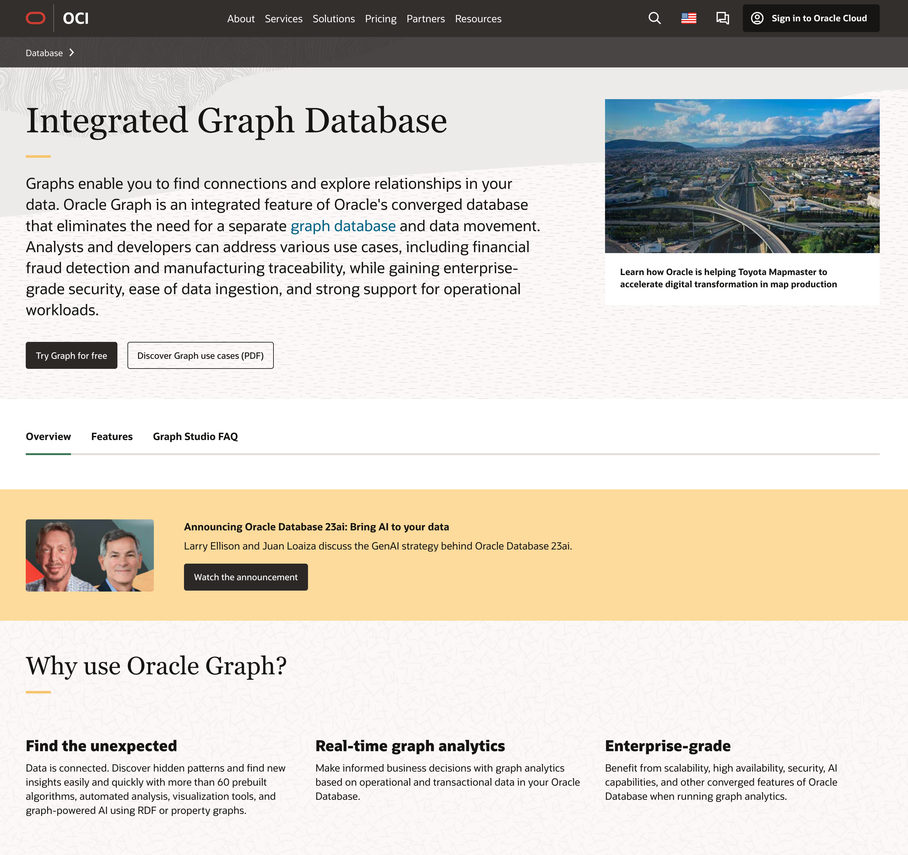

Graph pattern matching for SQL and NoSQL users
====================================

PGQL is a graph query language built on top of SQL, bringing graph pattern matching capabilities to existing SQL users as well as to new users who are interested in graph technology but who do not have an SQL background.

A high-level overview of PGQL
-----------------------------

Alongside SQL constructs like `SELECT`, `FROM`, `WHERE`, `GROUP BY` and `ORDER BY`, PGQL allows for matching fixed-length graph patterns and variable-length graph patterns.
Fixed-length graph patterns match a fixed number of vertices and edges per solution.
The types of the vertices and edges can be defined through arbitrary label expressions such as `friend_of|sibling_of`, for example to match edges that have either the label `friend_of` or the label `sibling_of`.
This means that edge patterns are higher-level joins that can relate different types of entities at once.
Variable-length graph patterns, on the other hand, contain one or more quantifiers like `*`, `+`, `?` or `{2,4}` for matching vertices and edges in a recursive fashion.
This allows for encoding graph reachability (transitive closure) queries as well as shortest and cheapest path finding queries.

PGQL deeply integrates graph pattern matching with subquery capabilities so that vertices and edges that are matched in one query can be passed into another query for continued joining or pattern matching.
Since PGQL is built on top of SQL's foundation, it benefits from all existing SQL features and any new SQL features that will be added to the standard over time.

PGQL is an [open-sourced project](https://github.com/oracle/pgql-lang), and we welcome contributions or suggestions from anyone and in any form.

A basic example
----------

An example property graph is:



Above, `Person`, `Company` and `Account` are vertex labels while `owner`, `worksFor` and `transaction` are edge labels.
Furthermore, `name` and `number` are vertex properties while `amount` is an edge property.

Assume that this graph is stored in the following tables in a database:



From these tables we can create the desired graph as follows:

```sql
CREATE PROPERTY GRAPH financial_transactions
  VERTEX TABLES (
    Persons LABEL Person PROPERTIES ( name ),
    Companies LABEL Company PROPERTIES ( name ),
    Accounts LABEL Account PROPERTIES ( number )
  )
  EDGE TABLES (
    Transactions
      SOURCE KEY ( from_account ) REFERENCES Accounts
      DESTINATION KEY ( to_account ) REFERENCES Accounts
      LABEL transaction PROPERTIES ( amount ),
    Accounts AS PersonOwner
      SOURCE KEY ( id ) REFERENCES Accounts
      DESTINATION Persons
      LABEL owner NO PROPERTIES,
    Accounts AS CompanyOwner
      SOURCE KEY ( id ) REFERENCES Accounts
      DESTINATION Companies
      LABEL owner NO PROPERTIES,
    Persons AS worksFor
      SOURCE KEY ( id ) REFERENCES Persons
      DESTINATION Companies
      NO PROPERTIES
  )
```

After we created the graph, we can execute a `SELECT` query to "produce an overview of account holders that have transacted with a person named Nikita":

```sql
  SELECT owner.name AS account_holder, SUM(t.amount) AS total_transacted_with_Nikita
    FROM MATCH (p:Person) <-[:owner]- (account1:Account)
       , MATCH (account1) -[t:transaction]- (account2) /* match both incoming and outgoing transactions */
       , MATCH (account2:Account) -[:owner]-> (owner:Person|Company)
   WHERE p.name = 'Nikita'
GROUP BY owner
```

The result is:

```
+----------------+------------------------------+
| account_holder | total_transacted_with_Nikita |
+----------------+------------------------------|
| Camille        | 1000.00                      |
| Oracle         | 4501.00                      |
+----------------+------------------------------+
```

Please see [PGQL 1.3 Specification](spec/1.3/) for more examples and a detailed specification of the language.

Oracle's Graph Database
----------------------------

PGQL is one of the central components of [Oracle's Graph Database](https://www.oracle.com/database/graph/).
Graphs can be created through mapping from tabular data by using PGQL's `CREATE PROPERTY GRAPH` statement.
Results of PGQL `SELECT` queries can be visualized in intuitive manner.
In addition to PGQL, Oracle's Graph Database provides support for RDF knowledge graphs, powerful built-in graph algorithms, support for popular notebooks, and much more.

{::nomarkdown}
<a href="https://www.oracle.com/database/graph/">
  
</a>
{:/}
