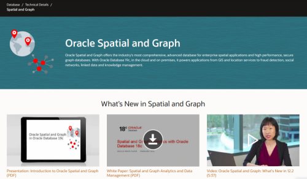
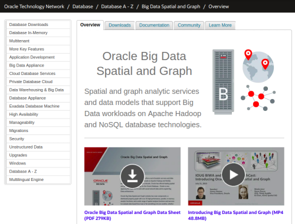
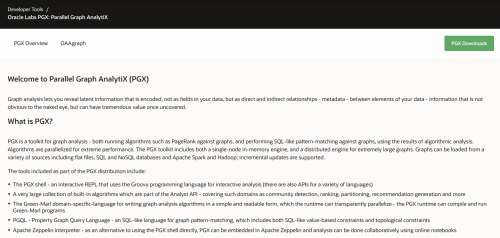

Graph pattern matching for SQL and NoSQL users
====================================

PGQL is a graph query language built on top of SQL, bringing graph pattern matching capabilities to existing SQL users as well as to new users who are interested in graph technology but who do not have an SQL background.

A high-level overview of PGQL
-----------------------------

Alongside SQL constructs like `SELECT`, `FROM`, `WHERE`, `GROUP BY` and `ORDER BY`, PGQL allows for matching fixed-length graph patterns and variable-length graph patterns.
Fixed-length graph patterns match a fixed number of vertices and edges per solution.
The types of the vertices and edges can be defined through arbitrary label expressions such as `friend_of|sibling_of`, for example to match edges that have either the label `friend_of` or the label `sibling_of`.
This means that edge patterns are higher-level joins that can relate different types of entities at once.
Variable-length graph patterns, on the other hand, contain one or more quantifiers like `*`, `+`, `?` or `{2,4}` for matching vertices and edges in a recursive fashion.
This allows for encoding graph reachability (transitive closure) queries as well as shortest and cheapest path finding queries.

PGQL deeply integrates graph pattern matching with subquery capabilities so that vertices and edges that are matched in one query can be passed into another query for continued joining or pattern matching.
Since PGQL is built on top of SQL's foundation, it benefits from all existing SQL features and any new SQL features that will be added to the standard over time.

PGQL is an [open-sourced project](https://github.com/oracle/pgql-lang), and we welcome contributions or suggestions from anyone and in any form.

A basic example
----------

An example property graph is:



Above, `Account`, `Person` and `Company` are vertex labels while `ownerOf`, `worksFor` and `transaction` are edge labels.
Furthermore, `name` and `number` are vertex properties while `amount` is an edge property.

Assume that this graph is stored in the following tables in a database:



From these tables we can create the desired graph as follows:

```sql
CREATE PROPERTY GRAPH financial_transactions
  VERTEX TABLES (
    Accounts LABEL Account,
    Persons LABEL Person PROPERTIES ( name ),
    Companies LABEL Company PROPERTIES ( name )
  )
  EDGE TABLES (
    Transactions
      SOURCE KEY ( from_account ) REFERENCES Accounts
      DESTINATION KEY ( to_account ) REFERENCES Accounts
      LABEL ( transaction )
      PROPERTIES ( amount ),
    PersonOwnerOfAccount
      SOURCE Persons
      DESTINATION Accounts
      LABEL ownerOf
      NO PROPERTIES,
    CompanyOwnerOfAccount
      SOURCE Companies
      DESTINATION Accounts
      LABEL ownerOf
      NO PROPERTIES
  )
```

After we created the graph, we can execute a `SELECT` query to "produce an overview of account holders that have transacted with a person named Nikita":

```sql
  SELECT owner.name AS account_holder, SUM(t.amount) AS total_transacted_with_Nikita
    FROM MATCH (p:Person) -[:ownerOf]-> (account1:Account)
       , MATCH (account1) -[t:transaction]- (account2) /* match both incoming and outgoing transactions */
       , MATCH (account2:Account) <-[:ownerOf]- (owner:Person|Company)
   WHERE p.name = 'Nikita'
GROUP BY owner
```

The result is:

```
+----------------+------------------------------+
| account_holder | total_transacted_with_Nikita |
+----------------+------------------------------|
| Camille        | 1000.00                      |
| Oracle         | 4501.00                      |
+----------------+------------------------------+
```

Please see [PGQL 1.3 Specification](spec/1.3/) for more examples and a detailed specification of the language.

Oracle products and toolkits
----------------------------

PGQL is part of the following Oracle products or toolkits and we invite you to try them out and/or reach out to us for help getting started.

{::nomarkdown}
</br>
<table>
<tr>
  <td width="50%">
    <a href="https://www.oracle.com/database/technologies/spatialandgraph.html">
      
    </a>
  </td>
  <td width="50%" style="vertical-align:middle;">
<p><font size="5">Oracle Spatial and Graph</font></p>
<p>
Oracle Spatial and Graph offers the industry’s most comprehensive, advanced database for enterprise spatial applications and high performance, secure graph databases. With Oracle Database 19c, in the cloud and on premises, it powers applications from GIS and location services to fraud detection, social networks, linked data and knowledge management.
</p>
  </td>
</tr>

<tr>
  <td width="50%">
    <a href="https://www.oracle.com/technetwork/database/database-technologies/bigdata-spatialandgraph/overview/index.html">
      
    </a>
  </td>
  <td width="50%" style="vertical-align:middle;">
<p><font size="5">Oracle Big Data Spatial and Graph</font></p>
<p>
Oracle Big Data Spatial and Graph Spatial and graph provides analytic services and data models that support Big Data workloads on Apache Hadoop and NoSQL database technologies.
</p>
  </td>
</tr>

<tr>
  <td width="50%">
    <a href="https://www.oracle.com/middleware/technologies/parallel-graph-analytix.html">
      
    </a>
  </td>
  <td width="50%" style="vertical-align:middle;">
<p><font size="5">Oracle Labs PGX: Parallel Graph AnalytiX</font></p>
<p>
PGX is a toolkit for graph analysis - both running algorithms such as PageRank against graphs, and performing SQL-like pattern-matching against graphs, using the results of algorithmic analysis. Algorithms are parallelized for extreme performance.
</p>
  </td>
</tr>

</table>
{:/}

Additional resources
====================

PGQL specifications
-------------------

 - [PGQL 1.3 Specification](spec/1.3/)
 - [PGQL 1.2 Specification](spec/1.2/)
 - [PGQL 1.1 Specification](spec/1.1/)
 - [PGQL 1.0 Specification](spec/1.0/)
 - [PGQL 0.9 Specification](https://docs.oracle.com/cd/E56133_01/1.2.1/PGQL_Specification.pdf)

Open-sourced PGQL parser
-----------------------

 - [Open-sourced parser and static query validator](https://github.com/oracle/pgql-lang) on GitHub

Oracle [Big Data] Spatial and Graph products
-----------------------------------

 - [Oracle Spatial and Graph Home](https://www.oracle.com/database/spatial/index.html)
     - [Spatial and Graph Property Graph Developer's Guide for Oracle Database 18c](https://docs.oracle.com/en/database/oracle/oracle-database/18/spgdg/index.html)
     - [Property Graph Query Language (PGQL)](https://docs.oracle.com/en/database/oracle/oracle-database/18/spgdg/sql-based-property-graph-query-analytics.html#GUID-301FF092-1A07-43D2-91E5-0C5AFF3467CC)
 - [Oracle Big Data Spatial and Graph Home](https://www.oracle.com/technetwork/database/database-technologies/bigdata-spatialandgraph/overview/index.html)
     - [Using Pattern-Matching Queries with Graphs](https://docs.oracle.com/en/bigdata/big-data-spatial-graph/2.5/bdspa/using-in-memory-analyst.html#GUID-96D9C0AA-CE52-48E6-A09E-D97E872A79A1)

PGX (Parallel Graph AnalytiX) toolkit
-----------------------------

 - [PGX Home](https://www.oracle.com/middleware/technologies/parallel-graph-analytix.html)
     - [PGQL extensions and limitations in PGX](https://docs.oracle.com/cd/E56133_01/latest/reference/analytics/pgql.html)
     - [Relevant Java API documentation](https://docs.oracle.com/cd/E56133_01/latest/prog-guides/graph-pattern-matching/index.html)
     - [Examples of Java API](https://docs.oracle.com/cd/E56133_01/latest/prog-guides/graph-pattern-matching/examples.html)
     - [Use case: Analyzing Superhero Network with Patterns and Computations](https://github.com/oracle/pgx-samples/blob/master/superhero/README.md)
     - [Using datetime data types](https://docs.oracle.com/cd/E56133_01/latest/prog-guides/data-types/datetime.html)

Blog posts
----------

 - [Using PGQL in Python](https://blogs.oracle.com/bigdataspatialgraph/using-pgql-in-python) (2018-05-22)
 - [How Many Ways to Run Property Graph Query Language (PGQL) in BDSG? (II)](https://blogs.oracle.com/bigdataspatialgraph/how-many-ways-to-run-property-graph-query-language-pgql-in-bdsg-ii) (2017-03-23)
 - [How Many Ways to Run Property Graph Query Language (PGQL) in BDSG? (I)](https://blogs.oracle.com/bigdataspatialgraph/how-many-ways-to-run-property-graph-query-language-pgql-in-bdsg-i) (2017-03-14)
 - [Property Graph Query Language (PGQL) support has been added to Oracle Database 12.2.0.1!](https://blogs.oracle.com/oraclespatial/property-graph-query-language-pgql-support-has-been-added-to-oracle-database-12201) (2017-03-10)

Training videos
---------------

 - [PGQL: A Query Language for Graphs](https://asktom.oracle.com/pls/apex/f?p=100:551:::NO:551:P551_CLASS_ID:4197&cs=1F6BF819D61CFBE3F44500E3F8E156C5C) (2018-10-02)

Original PGQL white paper
----------------

 - [PGQL: a Property Graph Query Language](http://dl.acm.org/citation.cfm?id=2960421) ([pdf](http://event.cwi.nl/grades/2016/07-VanRest.pdf)) (2016-06-24)
